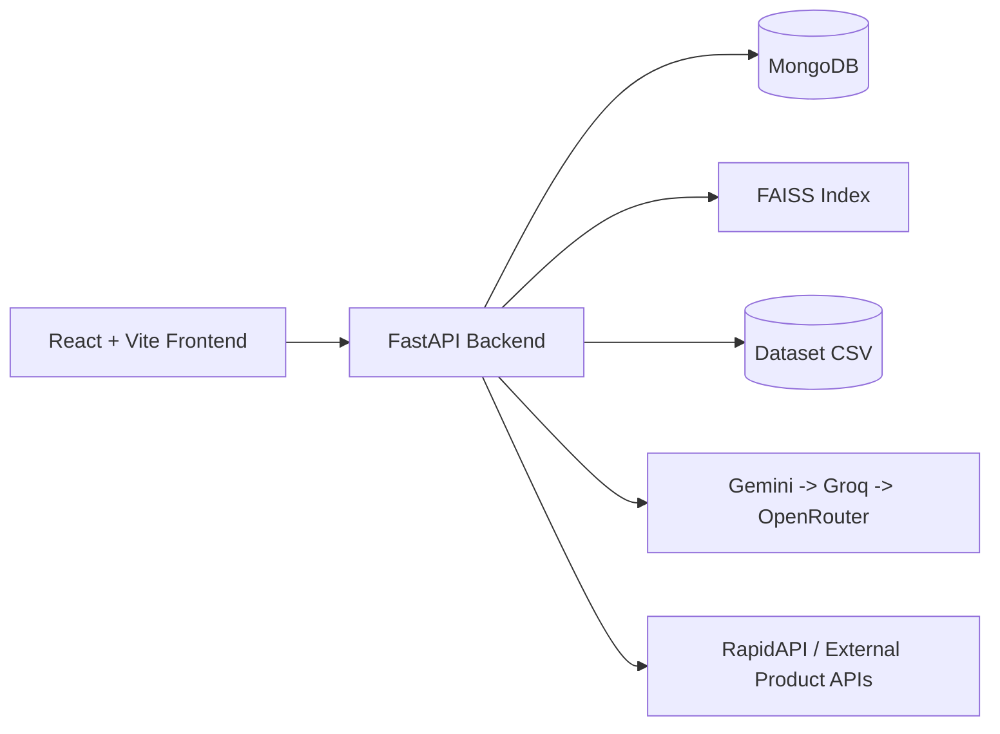

# ShopMind AI

AI Shopping Assistant + Recommendation Engine + Semantic Search + RAG + FAISS + MongoDB + LLM failover (Gemini/Groq/OpenRouter) + Analytics dashboard + Authentication.

---

## Project Overview

ShopMind AI is a full-stack commerce intelligence platform that combines:

- semantic product retrieval
- recommendation ranking
- LLM-assisted shopping copilot
- secure authentication/session management
- live/external API fallback pipelines

The codebase is optimized for:

- local development
- reproducible testing
- portfolio/demo review
- future deployment hardening

---

## Architecture



### High-level modules

- `frontend/`: React app, dashboard, assistant, recommendations UI
- `backend/main_api.py`: primary API service
- `backend/services/`: auth, DB, search, recommendation, RAG, ingestion
- `data/`: runtime dataset + generated index artifacts (generated artifacts ignored)
- `scripts/`: reproducibility utilities (e.g., FAISS build)
- `docs/`: release and archive documentation

---

## Features

- Semantic search with strict relevance guards
- Recommendation engine (user/product/hybrid)
- RAG-based shopping advice and URL analysis
- Auth flows: signup/signin/refresh/signout/profile/password update
- User dashboard with dynamic profile + metrics
- External API proxy with retry/cache/fallback behavior

---

## Tech Stack

### Backend

- FastAPI, Uvicorn
- Motor + PyMongo
- SentenceTransformers
- FAISS
- APScheduler
- HTTPX

### Frontend

- React + TypeScript + Vite
- Zustand
- React Query
- Recharts

---

## Repository Structure

```text
Shop-AI-
├── frontend/
├── backend/
├── docs/
├── scripts/
├── datasets/
│   └── README.md
├── data/
├── README.md
├── LICENSE
├── .gitignore
├── requirements.txt
├── package.json
└── docker-compose.yml
```

---

## Installation

### 1) Clone

```bash
git clone https://github.com/raiYan15/Shop-AI-.git
cd Shop-AI-
```

### 2) Backend dependencies

```bash
pip install -r requirements.txt
```

### 3) Frontend dependencies

```bash
cd frontend
npm install
cd ..
```

---

## Environment Setup

Copy template files and fill your own values:

- `.env.example` -> `.env` (optional root)
- `backend/.env.example` -> `backend/.env`
- `frontend/.env.local.example` -> `frontend/.env.local`

### Required backend variables

- `MONGODB_URI`
- `MONGODB_DB_NAME`
- `JWT_SECRET_KEY`
- `GEMINI_API_KEY`
- `GROQ_API_KEY`
- `OPENROUTER_API_KEY`
- `RAPIDAPI_KEY`
- `RAPIDAPI_HOST`

> Never commit `.env*` files with real credentials.

---

## MongoDB Setup

1. Create a MongoDB Atlas cluster (or local MongoDB)
2. Set `MONGODB_URI` and `MONGODB_DB_NAME`
3. Start API once to auto-create required indexes/collections

---

## Build FAISS / Embeddings

```bash
python scripts/build_faiss.py
```

Optional:

```bash
python scripts/build_faiss.py --products data/amazon.csv --model all-MiniLM-L6-v2
```

---

## Run Backend

```bash
python -m uvicorn backend.main_api:app --reload --host 0.0.0.0 --port 8000
```

---

## Run Frontend

```bash
cd frontend
npm run dev
```

---

## Docker (optional)

```bash
docker compose up --build
```

---

## API Surface (selected)

- `GET /health`
- `GET /products`
- `GET /search`
- `GET /recommendations/{user_id}`
- `GET /recommendations/hybrid/{user_id}`
- `POST /chat`
- `POST /copilot-advice`
- `POST /ai/analyze-product-url`
- `POST /auth/signup`
- `POST /auth/signin`
- `POST /auth/refresh`
- `GET /dashboard/me`

---

## Deployment Readiness Checklist

- [x] Frontend builds
- [x] Backend starts
- [x] MongoDB connectivity validated
- [x] Auth flows validated
- [x] Search + recommendation + assistant endpoints validated
- [x] Security hardening applied for env/secret handling

---

## Screenshots

Create `docs/screenshots/` and add UI screenshots for:

- Home
- Products
- Recommendations
- Assistant
- Profile Dashboard

---

## Roadmap

- Improve retrieval recall while preserving strict relevance guarantees
- Add CI quality gates (test + lint + security scan)
- Add observability dashboards (latency/error/SLA metrics)
- Add container production deployment templates (K8s/managed services)

---

## Contributors

- Project owner: [raiYan15](https://github.com/raiYan15)

---

## License

This project is licensed under the MIT License. See `LICENSE`.
